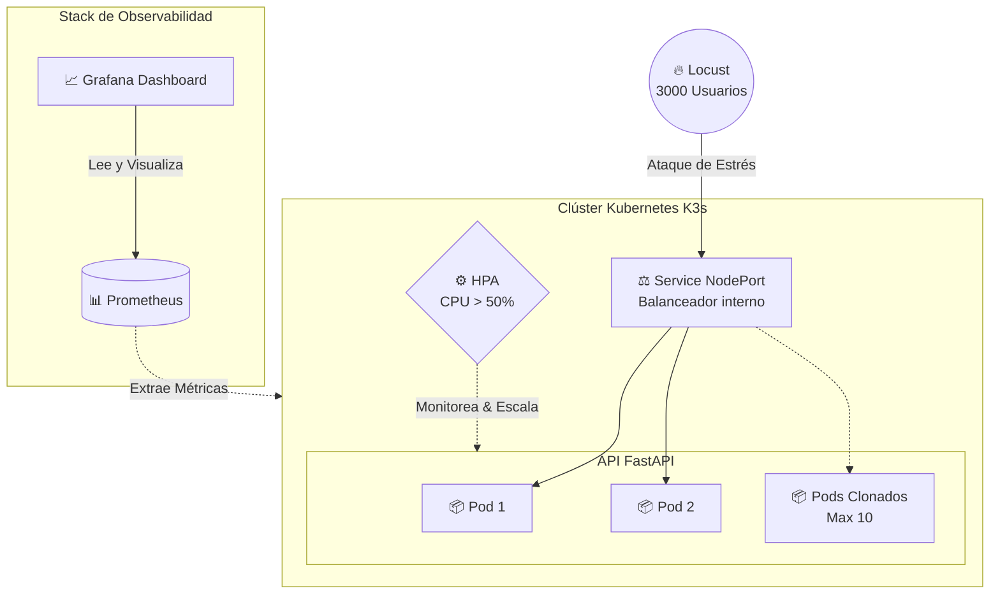

# ☁️ Cloud-Native IoT Gateway Architecture & Chaos Engineering

<p align="center">
  
  
  
  
  
</p>

Este repositorio contiene la Infraestructura como Código (IaC), los pipelines de de CI/CD y los manifiestos de Kubernetes para un clúster de alta disponibilidad. El proyecto simula la ingesta de datos de un Gateway IoT, orquestado en K3s y sometido a pruebas de estrés con Auto-escalado Horizontal (HPA).

## 🏗️ Arquitectura del Proyecto

- **Aplicación:** API RESTful construida con FastAPI y Uvicorn (optimizada para contenedores).
- **Orquestador:** Kubernetes (distribución ligera K3s).
- **Infraestructura:** Nodos basados en Linux Ubuntu, configurados vía Ansible.
- **CI/CD:** GitHub Actions para compilación automatizada y despliegue en Docker Hub.
- **Chaos Engineering:** Pruebas de carga distribuidas utilizando Locust.
- **Resiliencia:** Auto-escalado de Pods (HPA) configurado para reaccionar a picos de CPU.



---

## ⚠️ Paso 0: Preparación de la Plantilla Base (Template)

Para que la automatización funcione, no crearemos las máquinas desde cero. Debes tener una única **Máquina Virtual (Plantilla)** pre-configurada en tu hipervisor (ej. VirtualBox/Proxmox) con lo siguiente:

- SO: Ubuntu Server 22.04 o superior.
- Red configurada (Adaptador Puente/Bridged) para que reciba IP local.
- Tu llave pública SSH pre-cargada para acceso sin contraseña.

---

## 🏗️ Paso 1: Aprovisionamiento Automático (Terraform)

Utilizamos Terraform para clonar la plantilla base y desplegar la flota de servidores que conformarán el clúster.

1. Navega al directorio de infraestructura:

```bash
cd infra
```

2. Inicia Terraform y aplica los planos de infraestructura:

```bash
terraform init
terraform apply -auto-approve
```

3. **Identificación de IPs:** Una vez que Terraform termine de levantar el Master Node y los Worker Nodes, revisa la consola de tu hipervisor o tu router para identificar qué direcciones IP se les asignó automáticamente a las nuevas máquinas.

## ⚙️ Paso 2: Configuración del Clúster (Ansible)

Con las máquinas ya encendidas por Terraform, usaremos Ansible para instalar las dependencias, unir los nodos y levantar la red de K3s. Debido a que las direcciones IP varían en cada red local, debes actualizar el inventario antes de lanzar la automatización.

1. Abre el archivo de inventario:

```bash
nano inventory.ini
```

2. Reemplaza las IPs con las que acabas de rescatar de las máquinas clonadas:

```ini
[master]
192.168.x.x  # Remplazar

[workers]
192.168.x.x  # Remplazar
192.168.x.x  # Remplazar
```

3. Ejecuta el playbook principal para configurar los servidores e instalar K3s:

```bash
ansible-playbook -i inventory.ini deploy_k3s.yml
```

---

## 🐳 Paso 3: Integración Continua (CI/CD con Docker)

Antes de desplegar, necesitamos compilar el código de la API. Este repositorio usa **GitHub Actions** para automatizar la creación de la imagen Docker.

1. Al hacer un `git push` a la rama `main`, el workflow de `.github/workflows/main.yaml` se dispara automáticamente.
2. El robot lee el `Dockerfile` de la carpeta `api`, instala las dependencias de Python y compila la imagen.
3. Finalmente, sube la imagen etiquetada como `latest` a Docker Hub (`tu-usuario/iot-gateway`).
4. _Nota: Asegúrate de tener configurados los secrets `DOCKERHUB_USERNAME` y `DOCKERHUB_TOKEN` en tu repositorio de GitHub para que este paso funcione._

## 🔄 Paso 4: Despliegue de la API y Configuración del HPA

Una vez que el clúster **K3s** está activo y el Pipeline de GitHub ha publicado tu imagen Docker, procedemos a levantar la arquitectura.

### 1️⃣ Despliegue de la Aplicación

Desde tu **Master Node**, aplica el manifiesto principal que contiene el `Deployment` y el `Service` de la API (el clúster descargará automáticamente tu imagen de Docker Hub):

```bash
kubectl apply -f k8s/iot-deployment.yaml
```

### 2️⃣ Verificación de Estado

Asegúrate de que los contenedores iniciales (Pods) se hayan creado:

```bash
kubectl get pods -o wide
```

### 3️⃣ Activación del Auto-escalador (HPA)

Crea la regla matemática para que Kubernetes se defienda clonando la API si el consumo de CPU supera el 50%:

```bash
kubectl autoscale deployment iot-gateway-deployment --cpu=50 --min=2 --max=10
```

---

## 🔥 Paso 5: Chaos Engineering (Prueba de Estrés)

Para comprobar la resiliencia de la arquitectura, inyectaremos un nodo atacante para asfixiar la red interna, simulando miles de dispositivos IoT enviando telemetría simultáneamente.

### 1️⃣ Despliegue del Motor de Asedio

Lanza el pod de Locust dentro del clúster:

```bash
kubectl apply -f k8s/chaos-deployment.yaml
```

### 2️⃣ Monitoreo en Tiempo Real

En la terminal de tu Master Node, inicia el monitor de métricas del auto-escalador y déjalo corriendo:

```bash
kubectl get hpa -w
```

### 3️⃣ Ejecución del Ataque

Abre tu navegador web e ingresa a la interfaz gráfica de Locust usando la IP de tu Master Node y el puerto asignado (ejemplo: `http://192.168.x.x:8089`). Configura el ataque con estos parámetros:

- **Number of users:** `3000`
- **Ramp up (users per second):** `50`
- **Host:** `http://iot-gateway-service:8000` _(Apunta al DNS interno de Kubernetes)_

### 4️⃣ Observación del Auto-escalado

Vuelve a la terminal negra. A medida que Locust sature los recursos de la API, verás cómo el uso de CPU supera el límite de seguridad (50%) y la columna de réplicas comienza a subir automáticamente de 2 hasta 10, estabilizando el sistema sin interrupciones.

---

## 📊 Resultados y Observabilidad

Para validar la arquitectura, se sometió al clúster a un asedio de **3000 usuarios concurrentes**. Los resultados demuestran la alta disponibilidad y la capacidad de reacción del sistema:

- **Tasa de Errores:** 0% (Zero Downtime).
- **Escalabilidad:** El HPA detectó el pico de carga y elevó las réplicas de 2 a 10 de forma automática.
- **Estabilización:** Una vez finalizado el ataque, el clúster realizó un _scale-down_ gradual para optimizar el consumo de recursos.

<p align="center">
  
  <br>
  <i>Captura: Locust (Izquierda) mostrando 0% fallos y Grafana (Derecha) mostrando el escalado de Pods en tiempo real.</i>
</p>

_Simón Sánchez Ingeniero de Software_
